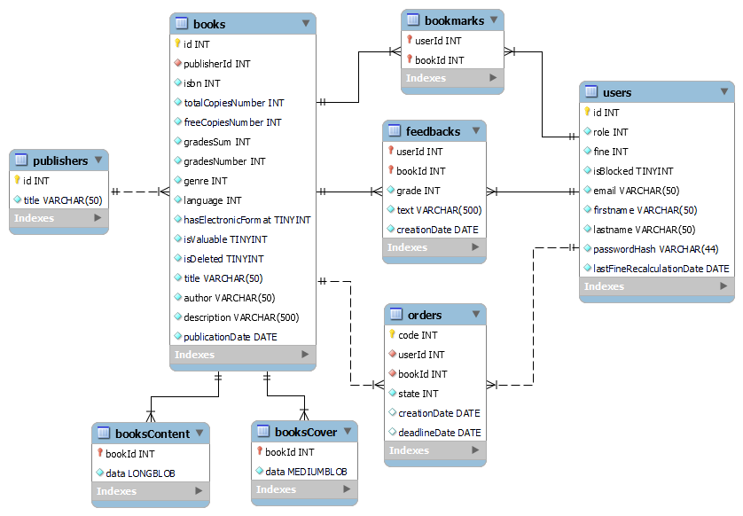

##Посилання на робочу версію сайту (AWS хостінг): 
###http://library-env-1.eba-xerm3t2k.us-east-1.elasticbeanstalk.com

Дані для входу
1. Адмін: пошта - **_admin@gmail.com_**, пароль - **_0000_**
2. Бібліотекар: пошта - **_elon@gmail.com_**, пароль - **_abcd_**
3. Читач: пошта - **_mark@gmail.com_**, пароль - **_iiii_**

Модель бази даних

# Інструкція користувача і можливості системи

Система призначена для автоматизації роботи користувачів з реальною бібліотекою.
Користувачі системи
1. Незареєстрований користувач (гість)
2. Зареєстрований користувач (читач)
3. Бібліотекар
4. Адміністратор

##Реєстрація та вхід в систему

Щоб використовувати розширені можливості бібліотеки необхідно зареєструватися в системі.
Для цього потрібно ввести своє імя, прізвище, адресу електорнної пошти, пароль для входу та пройти капчу.

Вже зареєстрований користувач може зайти в систему, використавши введені при реєстрації пошту та пароль.

Якщо користувач забув пароль, він може відновити його, ввівши свою поштову адресу та новий пароль.
Після цього на скриньку приходить повідомлення з лінком для підтвердження зміни паролю і входу в акаунт

##Можливості незареєстрованого користувача

Незареєстрований користувач має найбільш обмежений функціонал і може тільки продивлятися інформацію по книгам

Для знаходження книг можна використовувати базовий пошук (лише по назві) а також розширений пошук з використанням різних фільтрів і типів впорядкування

Фільтри розширеного пошуку книг:
- Формат (електронний, друкований та друкований з можливістю читання лише в межах бібліотеки)
- Жанр (пригоди, роман, драма, енициклопедія та інші)
- Мова (українська, англійська, японська та інші)
- ISBN (глобально унікальний код кожного друкованого видання)
- Назва (запит по назві шуканої книги)
- Автор (запит по імені автора шуканої книги)

Критерії та типи впорядкування (сортування) книг:
- Популярність (сортувати за середньою оцінкою користувачів на книгу від найвищої но найнижчої)
- Алфавіт (сортувати в алфавітному порядку по назві книги)
- Публікація (сортувати за датою публікації книги від нових до старих)

Про кожну знайдену книгу можна подивитися докладну інформацію
(назву та автора книги, дату її публікації, мову та жанр, коротки опис та кількість вільних друкованих копій книги в бібліотеці).
Також можна продивитися відгуки та оцінки користувачів на кожну знайдену книгу

##Можливості читача

Зареєстрований користувач (читач) може створювати замовлення на книги і використовувати їх

На сторінці книги читач, крім пошуку книг, може:
- Додавати книги у закладки (вподобання) для зручності
- Продивлятися список своїх закладок (вподобань) і виконувати по ним пошук
- Робити відгуки на книги і ставити їм оцінки
- Завантажувати електронний варіант книги у вигляді pdf документа (якщо книга має електронний формат)
- Створювати замовлення на друковані версії книг у бібліотеці

На сторінці замовлення відображається інформація про стан замовлень на книги,
а також дата їх створення і термін повернення книги.
Якщо книга не буде повернена у вказаний період, читачу буде нараховано штраф.
Після створення замовлення і до його підтвердження бібліотекарем, воно може бути відмінено самим читачем.

На сторінці профіль читач може змінювати параметри власного профілю (поштову адресу, імя, прізвище та паролі для входу).
Також тут читач може сплатити штраф за невчасно повернені книги.

##Можливості бібліотекаря

Бібліотекар може підтверджувати або скасовувати створені читачем замовлення

На сторінці замовлення бібліотекар може виконувати пошук замовлень з використанням різних фільтрів і типів впорядкування
Фільтри замовленнь:
- Код (унікальний автоматично згенерований номер замовлення)
- Статус (чекає на підтвердження, підтверджене, закрите та відмінене)
- Книга (шукати за вибраною книгою)
- Читач (шукати за вибраним читачем)

Критерії та типи впорядкування (сортування) замовленнь:
- За датою створення від старих но нових
- За датою створення від нових до старих
- За датою повернення від старих но нових
- За датою повернення від нових до старих

Також сторінці замовлення бібліотекар може генерувати і завантажувати звіти у вигляді xlsx таблиць:
- Таблиця з даними читачів (імя, поштова адреса, сума штрафу, кількість підтверджених та закритих замовлень читача, тощо)
- Таблиця з даними книг (назва, ISBN, кількість підтверджених та закритих замовлень на книгу, тощо)

На сторінці читачі бібліотекар може виконати базовий пошук читачів (по імені або адресі електронної пошти)
і вибрати одного з них для пошуку замовлень на сторінці замовлення

На сторінці книги бібліотекар може виконати базовий пошук книг (по назві) і вибрати одну з них для пошуку замовлень на сторінці замовлення
Також тут відповідно до кожної книги можна продивитися кількість вільних друкованих копій та загальну кількість копій у бібліотеці

##Можливості адміністратора

Адмін має найбільш широкий функціонал і може керувати книгами, бібліотекарями і читачами

На сторінці книги адмін, крім пошуку книг, може:
- Створити нову книгу
- Змінити існуючу книгу
- Видалити існуючу книгу

На сторінці бібліотекарі адмін може:
- Виконувати пошук бібліотекарів по імені або адресі електронної пошти
- Створювати нового бібліотекаря
- Видалити існуючого бібліотекаря

На сторінці читачі адмін може:
- Виконувати пошук читачів по імені або адресі електронної пошти а також використати пошукові фільтри (фільтр пошуку лише заблокованих читачів та фільтр пошуку лише читачів із штрафом)
- Заблокувати або розблокувати читача
- Сплатити штраф за читача

##Умова задачі

The reader registers in the system and then can:
- search by author or title
- place an order for a Book from the Catalog.
  An unregistered reader cannot order a book.
  For the catalog the ability to sort books has to be implemented:
- by name.
- by author.
- by publication.
- by date of publication.
  The librarian gives the reader a book on a subscription or to the reading room. The book is
  issued to the reader for a certain period. If the book is not returned within the specified
  period, the reader will be fined. The book may be present in the library in one or more
  copies. The system keeps track of the available number of books. Each user has a personal
  account that displays registration information
  And also:
1) for reader:
- list of books on the subscription and date of possible return (if the date is overdue, the
  amount of the fine is displayed);
2) for librarian:
- list of readers orders;
- list of readers and their subscriptions.
  The system administrator has the rights:
- adding, deleting a book, editing information about the book.
- create, delete librarian.
- blocking, unblocking the user.